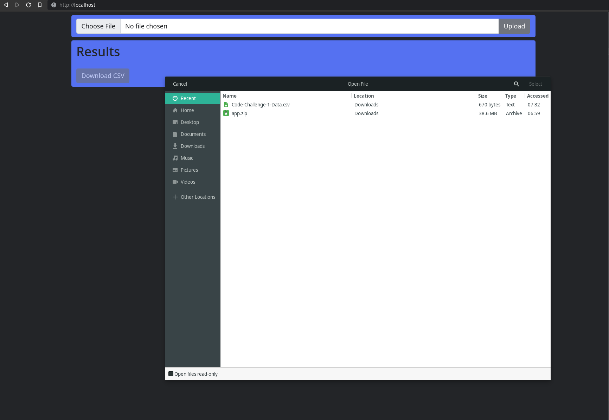

# About

This application provides a service to send invitations via text message or email.

A user uploads a `csv` formatted file and each row is processed according to the following user data:
1. send a text message invitation if a phone number is provided.
2. send an email invitation if no phone is provided but a valid email address is present.
3. don't send an invitation if the transaction date is outside the seven (7) day date range.
4. don't send duplicate invitations.

## Usage
1. A user is initially presented the following screen:

2. A file dialog prompt is displayed to select a `csv` for upload:

3. Upon selecting the `csv` file and clicking `Upload`, the results are displayed:

4. Click `Download CSV` to download a `csv` formatted version of the tabular data:

## Sample Output

See: [invite-results.csv](invite-results.csv)

